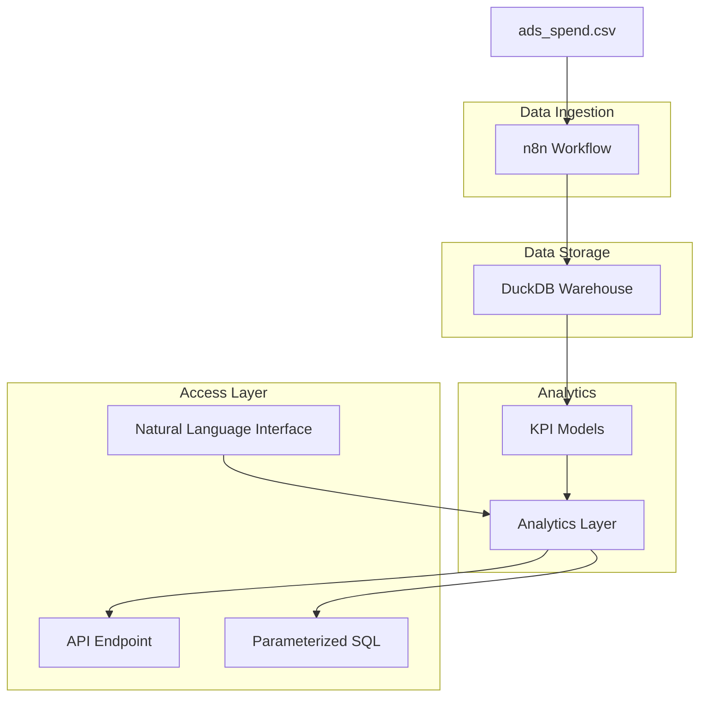

# Design Document

## Overview

The AI Data Engineer Platform is a comprehensive data engineering solution that demonstrates best practices for automated data ingestion, KPI modeling, and analytics accessibility. The system uses n8n for workflow orchestration, DuckDB as the data warehouse, and provides both API and SQL-based access to computed marketing metrics.

The platform processes advertising spend data with dimensions including date, platform (Meta/Google), account, campaign, country, device, and metrics (spend, clicks, impressions, conversions). It computes Customer Acquisition Cost (CAC) and Return on Ad Spend (ROAS) with time-based comparative analysis capabilities.

## Architecture

### High-Level Architecture



### Technology Stack

- **Orchestration**: n8n (workflow automation)
- **Data Warehouse**: DuckDB (embedded analytical database)
- **API Framework**: FastAPI or Flask (Python)
- **Documentation**: n8n MCP server integration
- **Version Control**: Git with public GitHub repository

## Components and Interfaces

### 1. Development Context (MCP Servers)

**Purpose**: MCP servers provide development context and documentation access during implementation, not part of the production system.

**Development MCP Configuration** (for implementation assistance):
```json
{
  "mcpServers": {
    "n8n-docs": {
      "command": "uvx", 
      "args": ["n8n-docs-mcp-server@latest"],
      "disabled": false,
      "autoApprove": ["search_docs", "get_node_docs"]
    },
    "duckdb-docs": {
      "command": "uvx",
      "args": ["duckdb-docs-mcp-server@latest"], 
      "disabled": false,
      "autoApprove": ["search_sql_docs"]
    }
  }
}
```

**Note**: These MCP servers are development tools to provide context about n8n workflows and DuckDB during implementation. They are not deployed components of the final system.

### 2. Data Ingestion Workflow (n8n)

**Workflow Components**:
- **CSV Reader Node**: Reads ads_spend.csv file
- **Data Transformation Node**: Adds metadata and validates data
- **DuckDB Connector Node**: Inserts data into warehouse table
- **Error Handling Node**: Manages failures and retries
- **Notification Node**: Logs completion status

**Metadata Enhancement**:
- `load_date`: Timestamp of ingestion (CURRENT_TIMESTAMP)
- `source_file_name`: Original filename for provenance
- `batch_id`: Unique identifier for each ingestion run

### 3. DuckDB Warehouse Schema

**Raw Data Table** (`raw_ads_spend`):
```sql
CREATE TABLE raw_ads_spend (
    date DATE,
    platform VARCHAR,
    account VARCHAR,
    campaign VARCHAR,
    country VARCHAR,
    device VARCHAR,
    spend DECIMAL(10,2),
    clicks INTEGER,
    impressions INTEGER,
    conversions INTEGER,
    load_date TIMESTAMP DEFAULT CURRENT_TIMESTAMP,
    source_file_name VARCHAR,
    batch_id VARCHAR
);
```

**Aggregated KPI Table** (`kpi_metrics`):
```sql
CREATE TABLE kpi_metrics (
    date DATE,
    platform VARCHAR,
    account VARCHAR,
    campaign VARCHAR,
    country VARCHAR,
    device VARCHAR,
    total_spend DECIMAL(10,2),
    total_conversions INTEGER,
    cac DECIMAL(10,4),
    roas DECIMAL(10,4),
    revenue DECIMAL(10,2),
    created_at TIMESTAMP DEFAULT CURRENT_TIMESTAMP
);
```

### 4. KPI Computation Models

**CAC Calculation**:
- Formula: `spend / conversions`
- Handles division by zero: Returns NULL when conversions = 0
- Aggregation levels: Daily, platform, account, campaign, country, device

**ROAS Calculation**:
- Formula: `(revenue / spend)` where `revenue = conversions × 100`
- Handles division by zero: Returns NULL when spend = 0
- Expressed as ratio (e.g., 2.5 = 250% return)

**Time Period Comparison**:
- Last 30 days vs Prior 30 days analysis
- Percentage change calculation: `((current - previous) / previous) * 100`
- Absolute value differences

### 5. Analytics API

**Endpoint Structure**:
```
GET /metrics?start_date=YYYY-MM-DD&end_date=YYYY-MM-DD
```

**Response Format**:
```json
{
  "period": {
    "start_date": "2025-01-01",
    "end_date": "2025-01-31"
  },
  "metrics": {
    "cac": {
      "current_period": 25.50,
      "previous_period": 28.75,
      "change_percent": -11.30,
      "change_absolute": -3.25
    },
    "roas": {
      "current_period": 1.85,
      "previous_period": 1.62,
      "change_percent": 14.20,
      "change_absolute": 0.23
    }
  },
  "breakdown": [
    {
      "platform": "Meta",
      "cac": 24.20,
      "roas": 1.92
    },
    {
      "platform": "Google", 
      "cac": 26.80,
      "roas": 1.78
    }
  ]
}
```

## Data Models

### Input Data Model
```python
class AdsSpendRecord:
    date: datetime.date
    platform: str  # Meta, Google
    account: str   # AcctA, AcctB, AcctC
    campaign: str  # Prospecting, Brand_Search, etc.
    country: str   # US, CA, BR, MX
    device: str    # Desktop, Mobile
    spend: Decimal
    clicks: int
    impressions: int
    conversions: int
```

### KPI Data Model
```python
class KPIMetrics:
    date: datetime.date
    platform: str
    account: str
    campaign: str
    country: str
    device: str
    total_spend: Decimal
    total_conversions: int
    cac: Optional[Decimal]  # Can be NULL if conversions = 0
    roas: Optional[Decimal] # Can be NULL if spend = 0
    revenue: Decimal
```

### Comparison Analysis Model
```python
class PeriodComparison:
    metric_name: str
    current_period_value: Decimal
    previous_period_value: Decimal
    absolute_change: Decimal
    percent_change: Decimal
    period_start: datetime.date
    period_end: datetime.date
```

## Error Handling

### Data Ingestion Errors
- **File Not Found**: Retry mechanism with exponential backoff
- **Schema Validation**: Log invalid records, continue processing valid ones
- **Database Connection**: Circuit breaker pattern with fallback to local storage
- **Duplicate Data**: Upsert strategy based on date + dimensions

### KPI Computation Errors
- **Division by Zero**: Handle gracefully by returning NULL values
- **Missing Data**: Skip periods with insufficient data, log warnings
- **Data Type Errors**: Validate and cast data types with error logging

### API Errors
- **Invalid Date Ranges**: Return 400 Bad Request with clear error message
- **No Data Found**: Return 404 with informative message
- **Database Unavailable**: Return 503 Service Unavailable with retry headers

## Testing Strategy

### Unit Tests
- **Data Transformation Logic**: Test KPI calculations with edge cases
- **API Endpoints**: Test all response scenarios and error conditions
- **Database Operations**: Test CRUD operations and constraint handling

### Integration Tests
- **n8n Workflow**: End-to-end ingestion testing with sample data
- **Database Persistence**: Verify data survives system restarts
- **API Integration**: Test complete request-response cycles

### Data Quality Tests
- **Schema Validation**: Ensure all required fields are present
- **Business Logic**: Verify CAC and ROAS calculations are accurate
- **Temporal Consistency**: Check date ranges and period comparisons

### Performance Tests
- **Ingestion Throughput**: Test with large CSV files (10K+ records)
- **Query Performance**: Benchmark API response times
- **Concurrent Access**: Test multiple simultaneous API requests

## Natural Language Query Interface

### Query Mapping Strategy
- **Pattern Recognition**: Map common business questions to SQL templates
- **Parameter Extraction**: Extract date ranges and dimension filters
- **Response Formatting**: Convert SQL results to natural language

### Example Mappings
```python
QUERY_PATTERNS = {
    "compare.*cac.*roas.*last.*30.*days": {
        "template": "period_comparison_template",
        "params": ["last_30_days", "prior_30_days"],
        "metrics": ["cac", "roas"]
    },
    "performance.*platform.*last.*week": {
        "template": "platform_breakdown_template", 
        "params": ["last_7_days"],
        "group_by": ["platform"]
    }
}
```

### Response Templates
```python
def format_comparison_response(data):
    return f"""
    CAC Analysis (Last 30 days vs Prior 30 days):
    - Current: ${data.cac.current:.2f}
    - Previous: ${data.cac.previous:.2f} 
    - Change: {data.cac.change_percent:+.1f}%
    
    ROAS Analysis:
    - Current: {data.roas.current:.2f}x
    - Previous: {data.roas.previous:.2f}x
    - Change: {data.roas.change_percent:+.1f}%
    """
```

## Deployment and Infrastructure

### Local Development Setup
- **DuckDB**: Embedded database, no separate installation required
- **n8n**: Docker container or local installation  
- **API Server**: Python virtual environment with FastAPI
- **Development MCP Servers**: Installed via uvx for documentation context during development

### Production Considerations
- **Data Backup**: Regular DuckDB file backups to cloud storage
- **Monitoring**: Application logs and performance metrics
- **Security**: API authentication and rate limiting
- **Scalability**: Consider migration to PostgreSQL for larger datasets

### CI/CD Pipeline
- **Automated Testing**: Run test suite on every commit
- **Code Quality**: Linting and type checking
- **Documentation**: Auto-generate API documentation
- **Deployment**: Automated deployment to staging/production environments